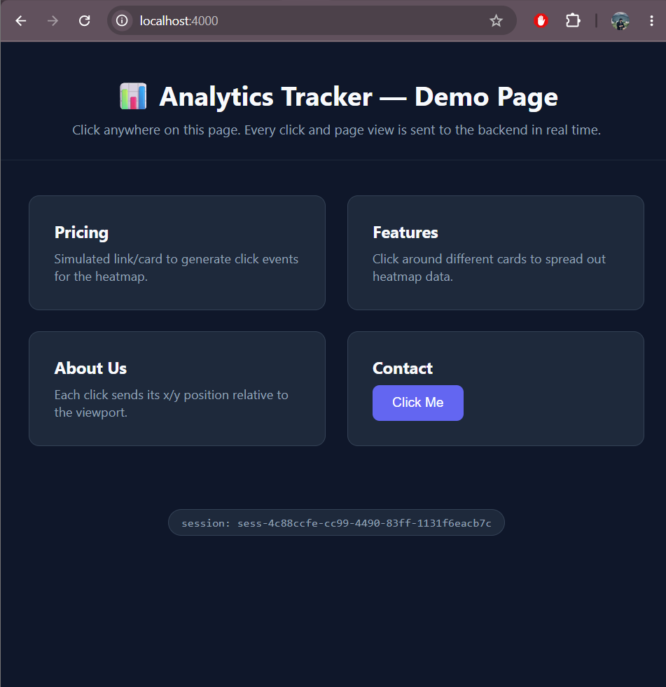
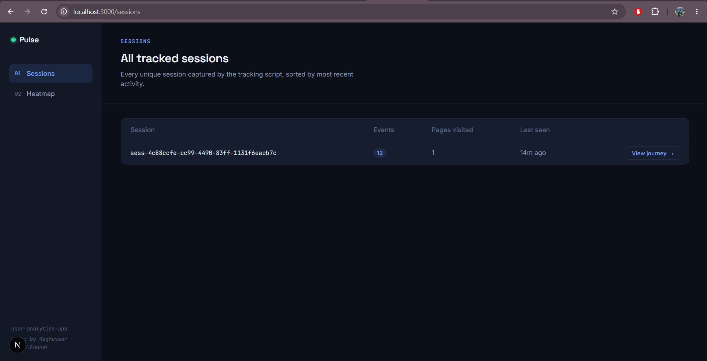
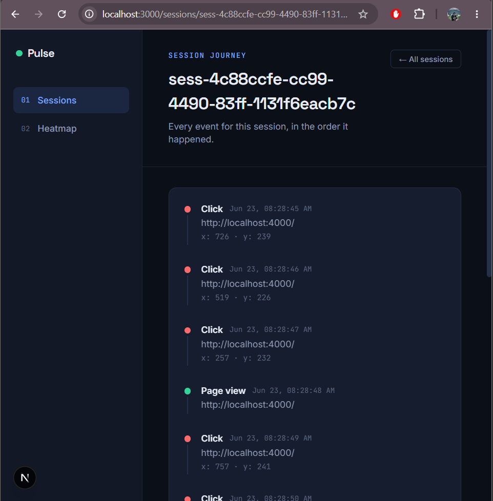
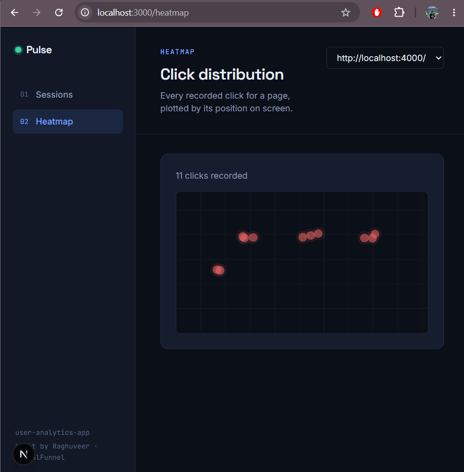

# Pulse — Simple User Analytics Application

A small full-stack analytics platform: a drop-in JavaScript tracking script that records `page_view` and `click` events, a Node.js/Express API that stores them in MongoDB, and a Next.js dashboard for exploring sessions and click heatmaps.

Built for the CausalFunnel Full Stack Engineer take-home assignment.

---

## Live demo

| | |
|---|---|
| **Dashboard** | [user-analytics-app-two.vercel.app](https://user-analytics-app-two.vercel.app) |
| **Backend API** | [user-analytics-backend-wwh8.onrender.com](https://user-analytics-backend-wwh8.onrender.com/health) |

> **Note:** the backend is hosted on Render's free tier, which spins down after periods of inactivity. The first request after idle time may take 30–60 seconds to wake it back up — subsequent requests are fast. If the dashboard briefly shows "Couldn't reach the API" on first load, refresh after a moment.

The demo tracking page is not separately hosted (see [Assumptions & trade-offs](#assumptions--trade-offs)); run it locally per the setup steps below to generate new events against either the live or local backend.

---

## Screenshots

**Demo page firing tracking events**


**Sessions list — tracked sessions with event counts**


**Session journey — ordered timeline of events for one session**


**Heatmap — click positions for a page**


---

## Tech stack

| Layer | Choice |
|---|---|
| Tracking script | Vanilla JavaScript (no dependencies, embeddable on any page) |
| Backend | Node.js + Express |
| Database | MongoDB (Mongoose) |
| Frontend | Next.js (App Router) + Tailwind CSS |
| Demo page | Static HTML to exercise the tracker end-to-end |

## Project structure

```
user-analytics-app/
├── backend/          # Express API + MongoDB models
│   ├── src/
│   │   ├── config/db.js
│   │   ├── models/Event.js
│   │   ├── controllers/eventController.js
│   │   ├── routes/eventRoutes.js
│   │   ├── app.js
│   │   └── server.js
│   ├── test/smoke.js # End-to-end route/controller smoke test
│   └── .env.example
├── frontend/         # Next.js dashboard
│   ├── app/
│   │   ├── sessions/page.js            # Sessions list
│   │   ├── sessions/[sessionId]/page.js # Session journey (ordered events)
│   │   └── heatmap/page.js             # Click heatmap
│   ├── components/
│   ├── lib/api.js    # API client
│   └── .env.local.example
├── demo/             # Standalone demo page + tracking script
│   ├── index.html
│   └── tracker.js
└── screenshots/      # Screenshots referenced in this README
```

## Local setup

The sections below walk through running everything yourself. If you just want to explore the working app, use the [live demo](#live-demo) links above instead.

### 1. Database

Create a free [MongoDB Atlas](https://www.mongodb.com/cloud/atlas/register) cluster (or point at a local MongoDB instance) and grab the connection string.

### 2. Backend

```bash
cd backend
npm install
cp .env.example .env
# edit .env and paste your MongoDB connection string into MONGODB_URI
npm run dev
```

The API starts on `http://localhost:5000` by default. Confirm it's healthy:

```bash
curl http://localhost:5000/health
```

**Run the included smoke test** (exercises every route against an in-memory fake of the data layer — no DB needed):

```bash
cd backend
node test/smoke.js
```

### 3. Frontend

```bash
cd frontend
npm install
cp .env.local.example .env.local
# edit .env.local if your API isn't on localhost:5000
npm run dev
```

The dashboard starts on `http://localhost:3000` and redirects to `/sessions`.

### 4. Demo page (to generate tracking data)

Open `demo/index.html` directly in a browser (or serve it with any static file server). It loads `tracker.js`, which is pointed at `http://localhost:5000/api/events` by default — make sure the backend is running first.

```bash
cd demo
npx serve .
# then open the printed localhost URL and click around
```

Within a few seconds of clicking around the demo page, sessions and click data will appear in the dashboard.

## API reference

| Method | Endpoint | Description |
|---|---|---|
| `POST` | `/api/events` | Store a single tracked event |
| `GET` | `/api/sessions` | List all sessions with event counts |
| `GET` | `/api/sessions/:sessionId/events` | Ordered event list for one session |
| `GET` | `/api/pages` | Distinct page URLs that have been tracked |
| `GET` | `/api/heatmap?page_url=...` | Click coordinates for a given page |
| `GET` | `/health` | Health check |

### Example event payload

```json
{
  "session_id": "sess-1a2b3c",
  "event_type": "click",
  "page_url": "https://example.com/pricing",
  "timestamp": "2026-06-22T10:15:30.000Z",
  "x": 412,
  "y": 218
}
```

## How the tracking script works

- **Session ID**: generated once per browser and persisted in `localStorage`. A session is considered to expire after 30 minutes of inactivity, after which a new ID is generated on the next event.
- **Event firing**: a `page_view` fires once on script load; a `click` listener is attached to the whole document and fires on every click with the click's `clientX`/`clientY`.
- **Transport**: uses `navigator.sendBeacon` when available (so events sent right before navigation aren't dropped), falling back to `fetch` with `keepalive: true`.
- **Embedding**: drop one script tag onto any page —

  ```html
  <script src="tracker.js" data-api-url="https://your-api.example.com/api/events"></script>
  ```

## Assumptions & trade-offs

- **Heatmap normalization**: click coordinates are captured relative to each visitor's own viewport. Since different visitors have different screen sizes, the heatmap view normalizes every click proportionally onto a fixed canvas (`x / viewport_width`, `y / viewport_height`) so dots from different devices land in comparable relative positions. A production version would likely bucket by device class or only compare clicks from similar viewport sizes.
- **Session expiry**: 30 minutes of inactivity was chosen as a reasonable, common default for "new session" semantics — there's no requirement spec for this, so it's a judgment call.
- **No authentication**: the assignment didn't call for user accounts or auth, so the dashboard and API are open. In a real product, the ingestion endpoint would need rate limiting / origin checks, and the dashboard would sit behind auth.
- **Single `events` collection**: rather than splitting `page_view` and `click` into separate collections, both are stored in one `Event` collection with a `event_type` discriminator field. This keeps the ingestion path simple (one write per event) and made the "ordered list of events for a session" requirement a single indexed query instead of a merge across collections.
- **CORS reflects the request origin** (`origin: true` + `credentials: true`) rather than using a literal wildcard, on the ingestion endpoint. This still allows the tracker to be embedded on any third-party page, but a literal `Access-Control-Allow-Origin: *` is incompatible with `navigator.sendBeacon()`'s credentialed request mode, which browsers block for security reasons — reflecting the origin back gets the same "allow everyone" behavior while satisfying that rule.
- **No real-time updates (e.g. WebSockets)**: the dashboard fetches on page load / navigation rather than subscribing to live updates. This was a scope call to keep the assignment focused on the four required read APIs; a polling or WebSocket layer would be a natural next step.
- **Demo page is static HTML, not part of the Next.js app**: keeping it separate makes it trivial to prove the tracker works on an arbitrary, unrelated page (the realistic use case), rather than only inside the same app as the dashboard.
- **Demo page isn't separately deployed**: the backend and dashboard are hosted (Render + Vercel), but the demo page is meant to simulate an arbitrary third-party site, so it's left as something to run locally against either backend. The included screenshots show it generating real tracked events end-to-end.

## Possible next steps

- Pagination on the sessions list and session journey for very high event volumes.
- Aggregated heatmap rendering (density/intensity instead of raw dots) for pages with thousands of clicks.
- Bot/duplicate-click filtering.
- Authentication on the dashboard and a per-site API key on the ingestion endpoint.
